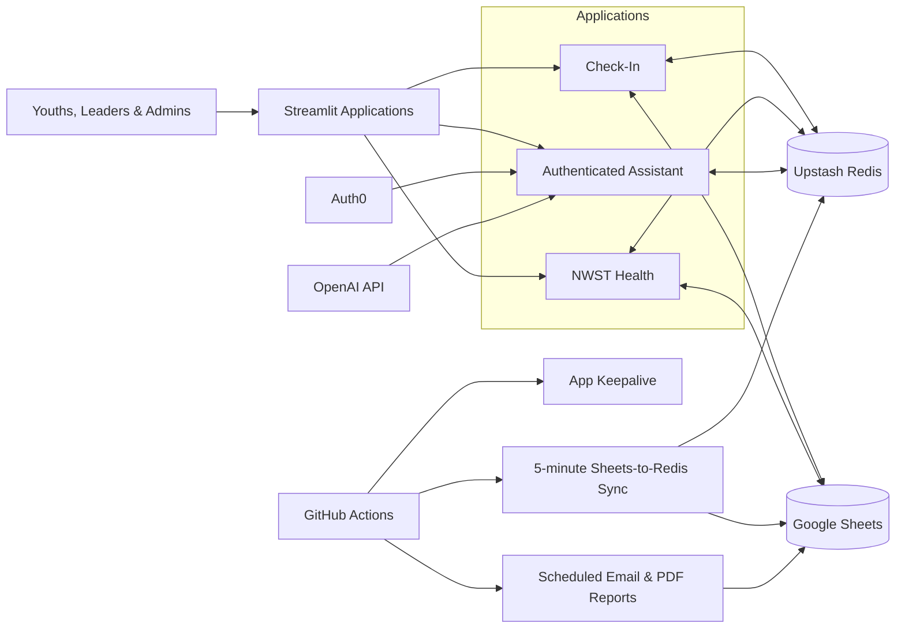

# NWST Youth Data Platform

> A volunteer-built data and operations platform for SIBKL Youth, pioneering the ministry's first unified system for attendance check-in, ministry analytics, cell-health monitoring, automated reporting, and authenticated self-service workflows.

## Overview

NWST Youth Data Platform was conceived, architected, developed, deployed, and maintained by a single volunteer developer to replace fragmented manual processes with a connected, data-informed operating system for the youth ministry.

The platform closes the loop between **data collection**, **operational workflows**, **analytics**, and **leadership action**:

1. Youths and leaders check in through a live application.
2. Attendance data is written to and synchronised from Google Sheets.
3. Redis caching supports responsive access, resilience, and reduced API usage.
4. Analytics surfaces attendance patterns at member, cell, and zone level.
5. Scheduled reports deliver actionable summaries to ministry leadership.
6. An authenticated AI-assisted interface supports approved self-service workflows.

## Why I Built It

The ministry previously relied on disconnected spreadsheets and manual processes for attendance tracking, reporting, and follow-up. This made it difficult to:

- obtain a reliable view of weekly participation;
- compare attendance across cells, zones, and ministry groups;
- identify emerging engagement or follow-up needs;
- produce recurring leadership reports efficiently; and
- maintain a consistent, self-service member-information workflow.

I pioneered the ministry's first dedicated data platform to make these workflows more reliable, scalable, and useful for decision-making.

## Core Product Surfaces

### 1. Live Check-In

A Streamlit-based operational application supporting congregation, leader, and ministry attendance workflows.

Key capabilities include:

- rapid member selection and check-in;
- cell- and zone-level mapping;
- duplicate check-in protection;
- Redis-backed pending-write queues;
- synchronisation with Google Sheets;
- live check-in summaries and visual breakdowns; and
- administrative refresh and recovery workflows.

### 2. NWST Health

An analytics interface for monitoring ministry participation and cell health.

Key capabilities include:

- attendance trends by cell and zone;
- member-level attendance history;
- current and historical cell-health views;
- week-on-week movement indicators;
- ministry and leadership participation views; and
- drill-down exploration from aggregate patterns to individual records.

### 3. Automated Leadership Reporting

A scheduled reporting workflow that generates and distributes recurring attendance and cell-health summaries.

Key capabilities include:

- weekly PDF report generation;
- check-in summaries and attendance rosters;
- cell-health snapshots;
- scheduled email delivery through GitHub Actions; and
- reusable report-generation components.

### 4. Authenticated AI-Assisted Workflows

An Auth0-protected Streamlit interface integrating approved ministry data with AI-assisted workflows.

Key capabilities include:

- authenticated access;
- structured access to approved ministry context;
- AI-assisted interpretation of member-information requests;
- validation against accepted fields and values; and
- Redis-backed application data.

## Architecture



## Engineering Decisions

### Google Sheets as the operational source of truth

Google Sheets was retained as the core operational store because it matched existing ministry workflows and allowed authorised leaders to inspect and maintain records without requiring a separate database interface.

### Redis as the application access layer

Upstash Redis provides:

- lower-latency reads for live applications;
- reduced Google Sheets API calls;
- shared cached state across application instances;
- pending-write queues for check-ins; and
- atomic duplicate-check-in protection.

### Scheduled synchronisation

GitHub Actions synchronises Google Sheets data to Redis every five minutes, ensuring that manual sheet updates are reflected in the applications while keeping live usage off the Sheets API where possible.

### Operational resilience

The check-in workflow supports queued writes and controlled flushing to Google Sheets. This allows attendance to be captured reliably while reducing the risk of duplicate submissions, API quota failures, or transient connection issues.

### Reusable application components

Shared modules centralise data loading, paths, styling, caching, and analytics logic across the check-in, health, and chatbot applications.

## Technology Stack

| Layer | Technology |
|---|---|
| Language | Python |
| Application framework | Streamlit |
| Data processing | pandas |
| Visualisation | Plotly, Altair |
| Operational data store | Google Sheets via gspread |
| Cache and queue | Upstash Redis |
| Authentication | Auth0 |
| AI integration | OpenAI API |
| Automation | GitHub Actions |
| Reporting | ReportLab / PDF generation |
| Deployment configuration | Streamlit secrets and environment variables |

## Repository Structure

```text
NWSTCheckin/
├── CHECK IN/
│   ├── attendance_app.py
│   ├── flush_pending.py
│   └── weekly_email_report.py
├── NWST HEALTH/
│   └── app.py
├── CHATBOT/
│   ├── chatbot_app.py
│   ├── chatbot_data.py
│   ├── chatbot_redis.py
│   └── chatbot_sync.py
├── nwst_shared/
│   └── shared application and analytics modules
├── .github/workflows/
│   ├── sync-redis.yml
│   ├── email-report.yml
│   └── keepalive.yml
├── sync_sheets_to_redis.py
├── scheduler.py
└── requirements.txt
```

## Running Locally

### 1. Clone the repository

```bash
git clone https://github.com/mirainsight/NWSTCheckin.git
cd NWSTCheckin
```

### 2. Create a virtual environment

```bash
python -m venv .venv
```

Activate it:

```bash
# macOS / Linux
source .venv/bin/activate

# Windows
.venv\Scripts\activate
```

### 3. Install dependencies

```bash
pip install -r requirements.txt
```

### 4. Configure secrets

Configure the required credentials through environment variables or `.streamlit/secrets.toml`.

Typical integrations include:

- Google service-account credentials;
- attendance and health Google Sheet IDs;
- Upstash Redis URL and token;
- Auth0 configuration;
- OpenAI API key; and
- email or SMTP credentials for scheduled reporting.

Do not commit credentials, member data, or production identifiers to the repository.

### 5. Run an application

```bash
streamlit run "CHECK IN/attendance_app.py"
```

```bash
streamlit run "NWST HEALTH/app.py"
```

```bash
streamlit run "CHATBOT/chatbot_app.py"
```

## Impact

> Replace the placeholders below with anonymised, aggregate figures before publishing.

- **[X]+** youth and leader profiles supported
- **[Y]+** attendance records processed
- **[Z]** average weekly check-ins
- **[N]** cells and **[M]** zones represented
- **[P]** recurring leadership users
- **[Q] hours** of manual reporting effort saved per month
- Ministry's **first dedicated data and analytics platform**

## Screenshots

Add anonymised screenshots or mock data for:

1. Live check-in interface
2. Cell- and zone-level attendance view
3. NWST Health dashboard
4. Weekly leadership report
5. Authenticated assistant workflow

> Ensure that names, contact details, birthdays, attendance histories, and other identifiable member information are removed or replaced with synthetic data.

## Privacy and Security

This platform handles sensitive ministry and member information. Production deployments should follow these safeguards:

- keep member data outside the public repository;
- store credentials only in secrets managers or environment variables;
- use least-privilege Google service accounts;
- restrict authenticated interfaces to authorised users;
- avoid exposing production spreadsheet IDs or internal URLs;
- anonymise all screenshots and sample datasets; and
- review Git history before making the repository public.

## Project Ownership

**Creator, architect, sole developer, and maintainer:** Miracle

I independently pioneered and built this platform as a volunteer initiative for SIBKL Youth — from problem discovery and product design through application development, data architecture, deployment, automation, and ongoing operation.

## Status

Actively developed and operated for ministry use.
